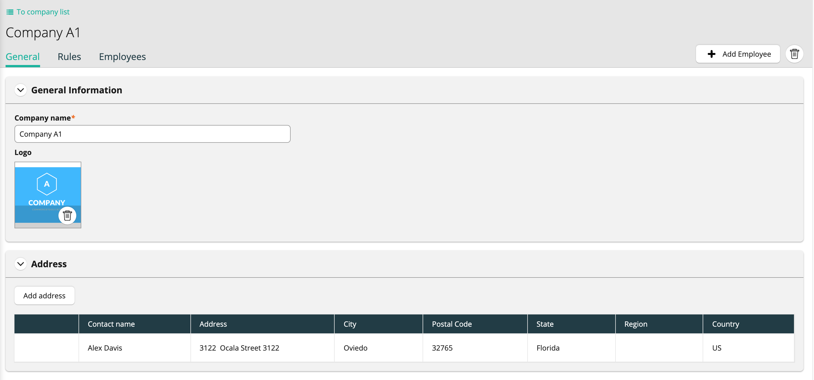
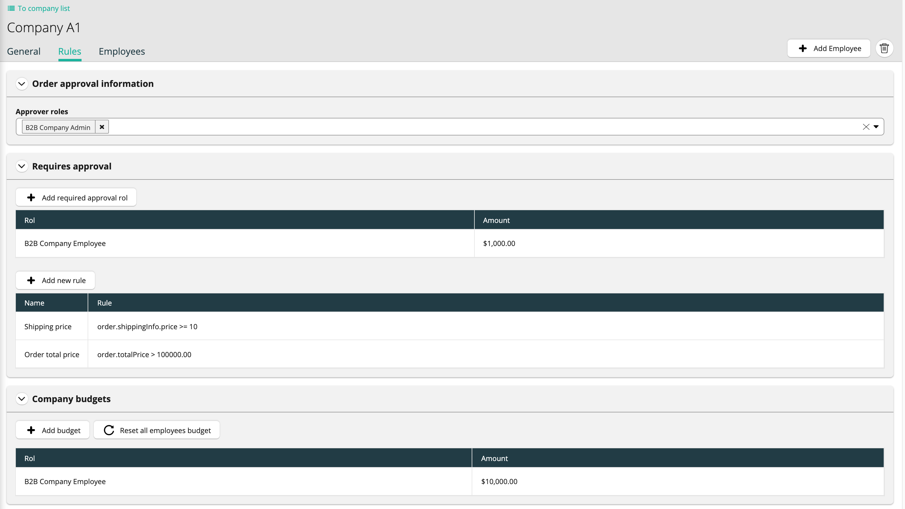
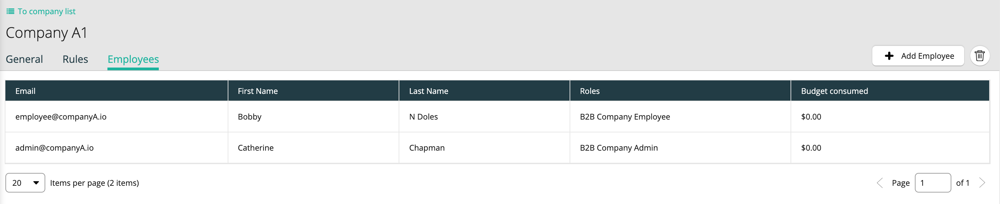
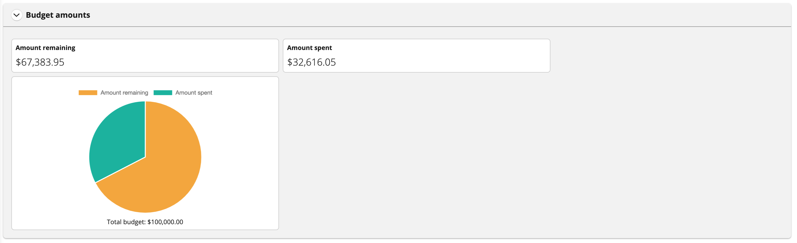
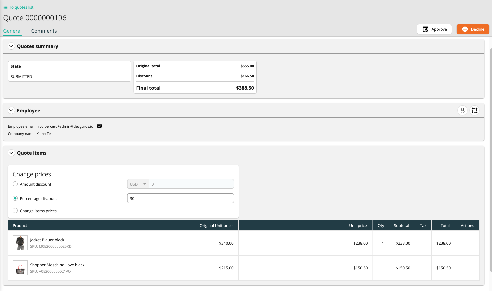
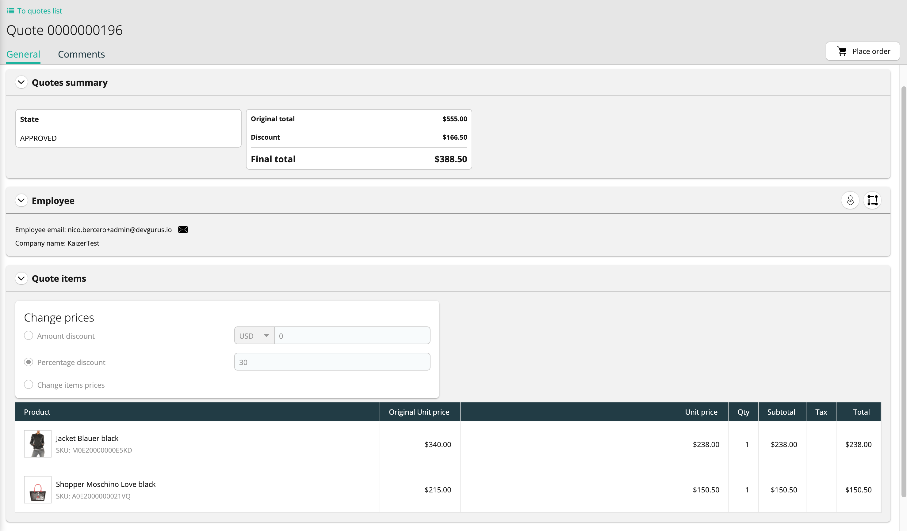
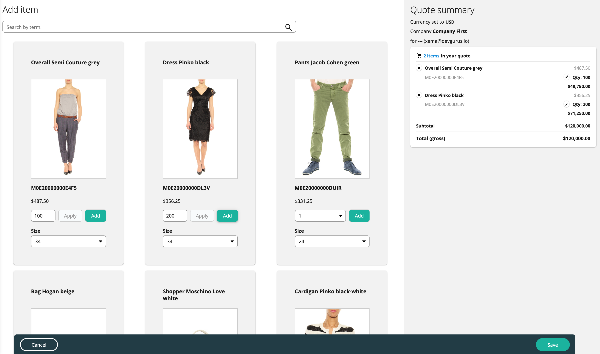
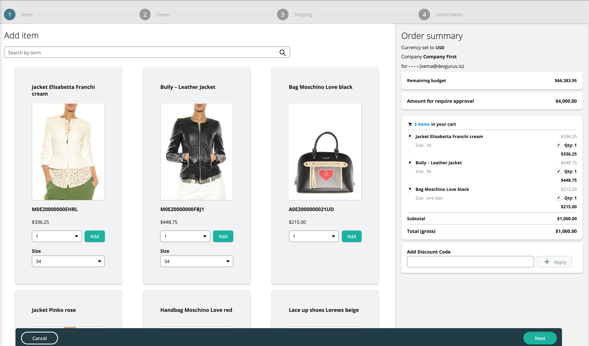
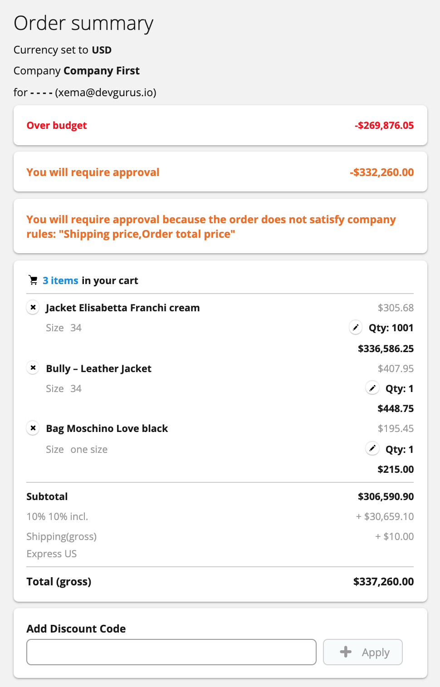
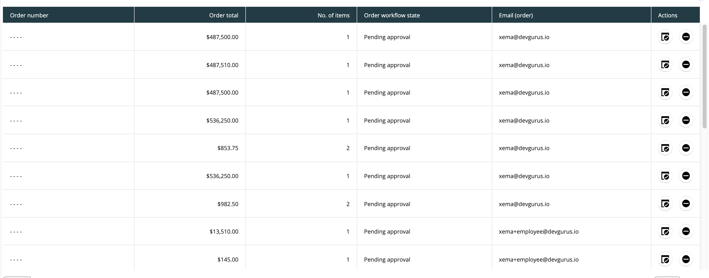

<!--lint disable list-item-bullet-indent-->
<!--lint disable list-item-indent-->
# B2B CUSTOM APPLICATIONS

## Overview
This package includes the custom app for handle companies, employees, budgets, quotes ...
The custom app has been developed based on the [commeercetools documentation](https://docs.commercetools.com/custom-applications/)

## Content
The custom app has the following elements:
 - **B2B Admin:** Menu for the store manager. From this menu it is possible:
	 - See and handle companies
	 - See and handle employees
	 - See and handle quotes
	 
 - **B2B Company:** Menu for company employees.  From this menu it is possible:
	 - See orders than belongs to the company
	 - Approve or reject orders created
	 - Add employees to the company
	 - See and request quote to the B2B Store admin
	 - Checkout orders

## Functionality 
### Companies
 - Create/edit/remove companies for the store
 - Add or remove employees for the company
 - Handle the order creation rules for the company
	 - Select which employees can approve the orders
	 - Define the company's rules for order approval
	 - Define employee budgets
	 - Reset employee budgets

<table>
  <tr>
    <th> </th>
    <th></th>
    <th>  </th>
  <tr>
</table>

### Employees
 - Create/edit/remove employees 
 - Assign employees to a company
 - Check budget amounts (remaining and spent)
<table>
  <tr>
    <th>  </th>
  <tr>
</table>

### Quotes
 - List all the quotes (B2B Admin user)
 - List company quotes (B2B Company user)
 - Request new quotes  (B2B Company user)
 - Apply discounts to submitted quotes (B2B Admin user)
 - Approve or reject quotes (B2B Admin user)
 - Create a new order based on the approved quote  (B2B Company user)

<table>
  <tr>
    <th> </th>
    <th></th>
    <th></th>
  <tr>
</table>

### Checkout new orders
B2B Company can create sales orders in the following way 
 - Checkout new orders directly
 - Checkout new orders based on approved quotes
Based on the company's rules the order will be created with the state *Confirmed* or *Pending approval*.

<table>
  <tr>
    <th> </th>
    <th></th>
  <tr>
</table>

### Approve or reject orders
Employees with the approving role in his company, can decide whether to approve or reject orders in state *Pending approval*
<table>
  <tr>
    <th> </th>
  <tr>
</table>

## Configuration
### Adding custom app
Go to *Settings* -> *Custom applications* -> *Register a custom application*
#### B2B Admin menu

 - **Name:** *B2B Admin*
 - **Application URL:** *{firebase hosting domain}*. Should be < firebase-project-name >.firebaseapp.com
 - **Main route path:** *b2b-extension*
 - **Main navigation**
	 - **Link label:** *B2B Admin*
	 - **Link permissions:** *ManageCustomerGroups* and *ManageCustomers*
	 - **Link icon**: *Any*
 - **Sub navigation:**  
	 - Companies list:
		 - **Link to:** *companies*
		 - **Link label:** *Companies list*
		 - **Link permissions:** *ManageCustomerGroups*
	 - Add company:
		 - **Link to:** *companies/new*
		 - **Link label:** *Add company*
		 - **Link permissions:** *ManageCustomerGroups*
	- Employees list:
		 - **Link to:** *employees*
		 - **Link label:** *Employees list*
		 - **Link permissions:** *ManageCustomers*
	 - Add employee:
		 - **Link to:** *employees/new*
		 - **Link label:** *Add employee*
		 - **Link permissions:** *ManageCustomers*
	 - Quotes list:
		 - **Link to:** *quotes*
		 - **Link label:** *Quotes list*
		 - **Link permissions:** *ManageCustomers* and *ManageOrders*

#### B2B Company menu
 - **Name:** *B2B Company*
 - **Application URL:** *{firebase hosting domain}*. Should be < firebase-project-name >.firebaseapp.com
 - **Main route path:** *b2b-extension/my-company*
 - **Main navigation**
	 - **Link label:** *B2B Company*
	 - **Link permissions:** *ViewCustomers*, *ViewOrders* and *ViewCustomerGroups*
	 - **Link icon**: *Any*
 - **Sub navigation:** 
	 - Employees list:
		 - **Link to:** *employees*
		 - **Link label:** *Employees list*
		 - **Link permissions:** *ViewCustomers* and *ViewCustomerGroups* 
	 - Orders list:
		 - **Link to:** *orders*
		 - **Link label:** *Orders list*
		 - **Link permissions:** *ViewOrders*
	 - Add order:
		 - **Link to:** *orders/new*
		 - **Link label:** *Add order*
		 - **Link permissions:** *ManageOrders*
	 - Pending approval orders list:
		 - **Link to:** *orders-approval*
		 - **Link label:** *Pending approval orders list*
		 - **Link permissions:** *ViewOrders*
	 - Add employee:
		 - **Link to:** *employees/new*
		 - **Link label:** *Add employee*
		 - **Link permissions:** *ManageCustomers*
	- Quotes list:
		 - **Link to:** *quotes*
		 - **Link label:** *Quotes list*
		 - **Link permissions:** *ViewOrders*
	 - Request quote:
		 - **Link to:** *quotes/new*
		 - **Link label:** *Request quote*
		 - **Link permissions:** *ViewOrders*
		 
### Setting Organization and teams permissions
 - Create the organization: Go to *Manage organizations & teams* -> *Add organization*
	- **Organization Name:** *CT-B2B*
	- **Settings**
		- SSO: In case you want to enable sso login for the B2B module, the **Team ID** should be *B2B Company*
 - Create the teams: Go to *Add team*
	 - **Name**: *B2B Admin*
	 - **Permissions**:
		 - Disable: Developer settings -  General Permissions
 - Create the teams: Go to *Add team*
	- **Name**: *B2B Company*
	- **Hide menu items**: Hide all items except *custom applications*
	- **Permissions**
	
|ENTITY  |VIEW ALL  |VIEW AND EDIT ALL|
|--|--|--
|PRODUCTS  |ENABLE  |DISABLE
|CATEGORIES  |ENABLE  |DISABLE
|CUSTOMERS  |ENABLE  |DISABLE
|CUSTOMER GROUPS  |ENABLE  |DISABLE
|ORDERS  |ENABLE  |ENABLE
|PRODUCT DISCOUNTS  |ENABLE  |DISABLE
|DISCOUNT CODES  |ENABLE  |DISABLE
|PROJECTS SETTINGS  |ENABLE  |DISABLE
|PRODUCT TYPES  |ENABLE  |DISABLE
|PRODUCT DISCOUNTS  |ENABLE  |DISABLE
|DEVELOPER SETTINGS  |ENABLE  |DISABLE
